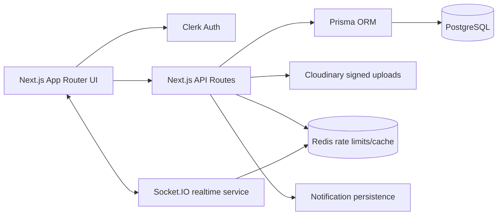
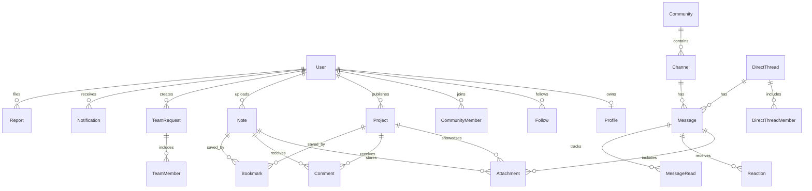

# StudentHub Architecture

## Product architecture

StudentHub combines four student workflows into one SaaS-grade platform:

1. **Discord-style communities**: admin-created community spaces with ordered channels, real-time messages, mentions, replies, reactions, pins, attachments, read receipts, and moderation.
2. **LinkedIn-style profiles**: searchable public profiles with college, degree, year, skills, interests, social links, follows, and project activity.
3. **Reddit-style discussions and notes**: searchable resources with filters, bookmarks, upvotes, downloads, and comment threads.
4. **GitHub-style project showcase**: student projects with rich media, tech stacks, likes, saves, comments, GitHub links, and demo links.

## Runtime architecture



## Database ER diagram



## Folder structure

```text
app/                         Next.js 15 App Router pages and API routes
app/(marketing)/             Public landing experience
app/(app)/                   Authenticated product shell and feature pages
app/api/                     Server-only validated API endpoints
components/ui/               Shadcn-inspired reusable primitives
components/shell/            Dashboard navigation shell
components/features/         Product-specific presentational components
lib/                         Auth, database, validation, rate limit, Cloudinary helpers
prisma/                      PostgreSQL schema and seed data
docs/                        Architecture, ERD, API, and operational notes
src/realtime/                Socket.IO realtime service
```

## API design

| Endpoint | Methods | Purpose | Security |
| --- | --- | --- | --- |
| `/api/profile` | `PATCH` | Update authenticated profile and social links | Clerk auth, Zod validation, rate limit |
| `/api/search` | `GET` | Global search across users, communities, projects, and notes | Clerk auth, query validation |
| `/api/projects` | `GET`, `POST` | List and publish projects | Clerk auth, server validation, rate limit |
| `/api/notes` | `GET`, `POST` | Filter and upload note metadata | Clerk auth, server validation, rate limit |
| `/api/team-requests` | `GET`, `POST` | Discover and create team requests | Clerk auth, server validation, rate limit |
| `/api/communities/[communityId]/messages` | `GET`, `POST` | Read and create channel messages | Clerk auth, attachment validation, rate limit |
| `/api/upload/signature` | `POST` | Generate signed Cloudinary upload params | Clerk auth, MIME/size validation, rate limit |
| `/api/notifications` | `GET` | Read notifications | Clerk auth |

## UI wireframe plan

- **Marketing**: premium hero, product proof cards, strong CTAs, dark/light support.
- **Dashboard**: platform metrics, default communities, quick discovery modules.
- **Community**: left channel rail, responsive message feed, empty states for new channels.
- **Profile**: banner, avatar, bio, skills, social links, follow actions, activity metrics.
- **Notes**: resource grid with subject/semester filters, downloads, upvotes, bookmarks.
- **Projects**: showcase cards with tech stacks, GitHub/demo actions, likes/comments/saves.
- **Teams**: role-based request cards and join flow entry points.
- **Admin**: metrics, reports queue, moderation and analytics foundation.

## Security controls

- Clerk middleware protects authenticated routes and API endpoints.
- Zod schemas validate all user-submitted payloads server-side.
- Redis-backed rate limiting protects write-heavy endpoints with in-memory fallback for local development.
- Cloudinary upload signatures are generated only after MIME type and size checks.
- Next.js security headers disable framing and MIME sniffing.
- Prisma relations use cascading deletes intentionally and indexes cover search/feed access paths.
- Role-based access gates admin routes with `ADMIN` and `MODERATOR` roles.

## Deployment notes

- Deploy the Next.js application to Vercel with `DATABASE_URL`, Clerk, Cloudinary, and Redis environment variables configured.
- Run `npm run prisma:migrate` during release workflows and `npm run seed` after initial database creation.
- Host the Socket.IO process as a small Node service where long-lived WebSockets are supported; use Redis pub/sub for horizontal scale.
